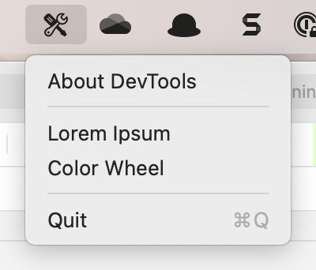

# DevHelpers

So there are a bunch of things that I do rarely in development and, every tie I do them, I have to
relearn how they work or I have to search for the web-site I used last time. It's a pain for something
that should be simple.

I also wanted an excuse to create a status bar app for the Mac... but that's a secondary consideration, honestly.

The premise of the app is an icon on the status bar which, when clicked, drops down a list of tools:

The number and type of tools is going to change over time. To date, I've added these:

## Lorem Ipsum Generator

There are times when I want to generate some dummy text and the old school way of doing that is 
with Lorem Epsom text. It's basically non-sensical text that gives the impression of real text allowing you
to judge the look of your code once it is populated with text. I've done this a few times and, every time, I have
ended up on yet another web site. So I created the Loren Ipsum generator.

## Colour Picker

There are often times when I need a colour. I know there is a colour picker somewhere in Xcode, but
finding it is another matter. So I needed a colour picker:

## Image Generator

When I'm creating web sites, I often need to see what the site is going to look like before I have final
graphic files. To do that, I create place holder images of the required size. 

Just to make the output more interesting, it has an auto-generation mode that generates a random
image based on random colours and shapes. 

# Note!

This is a work in progress and will change from time to time. I have no specific development schedule
for the app at this time.

